

# E-Commerce BackEnd

## Week 13 Challenge

### Victor McGuire

## Table of Contents

1. [Description](#Description)
2. [Installation Instructions](#Installation-Instructions)
3. [Usage Instructions](#Usage-Instructions)
4. [Contribution Guidelines](#Contribution-Guidelines)
5. [Test Instructions](#Test-Instructions)
6. [Questions](#Questions)
7. [License](#License)

## Description

The purpose of this project is to create backend for an ecommerce website to organizing and manipulating via CRUD data having to do with products, their categories, and product tags.

## Installation Instructions

Access the application by accessing it here and downloading the files: https://github.com/vmcguire/e-commerce

You will also need express, MySQL2, node_modules, and the dotenv package to make this work.

## Usage Instructions

Demonstration video of usage is here: https://drive.google.com/file/d/1kdn-soAKR_v1Hhho5F9xgzCM-crKr-ty/view

Navigate to the root folder of the application where the server.js file sits.

To create the data base, you can source the schema.sql file by changing the sequelize sync force value to 'true' in the server.js file, and running the server by 'npm start' in the command line of the root folder (as seen in the screen shot below).

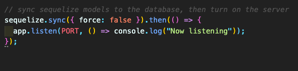

To seed the data, in the command line excute the command 'npm run seed'.

To start the server, execute in the command line, npm start.

### Screen Shots Below:

### 1. Here is the opening screen of the video. Please select the video in the Usage Instructions

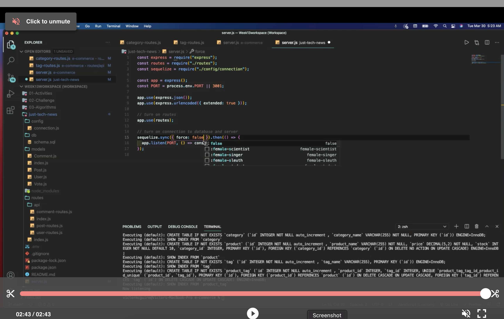

## Contribution Guidelines

Feel free to contribute and mark your contributions.

## Test Instructions

Feel free to test using Insomnia as the screen shots show below.

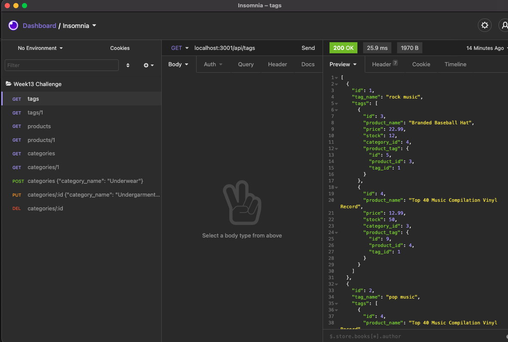
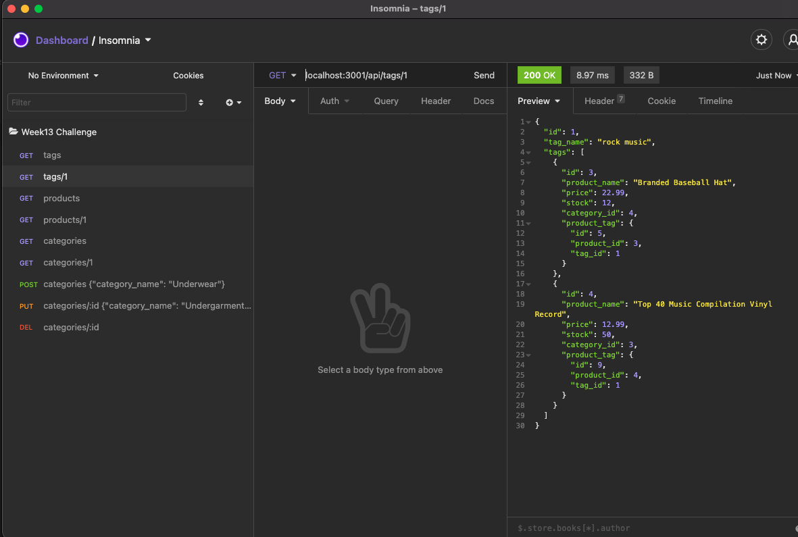
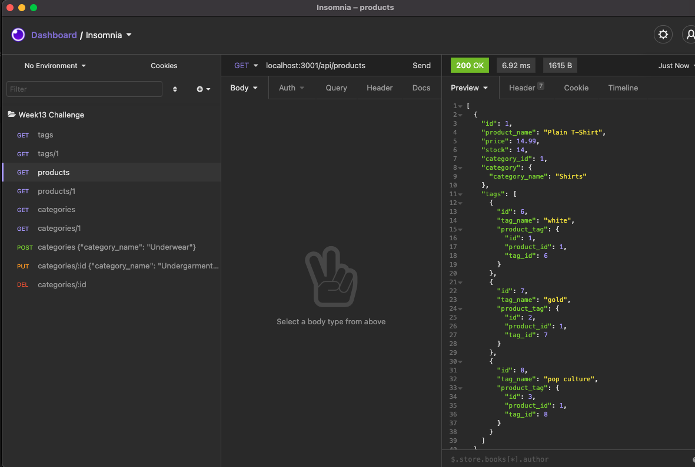
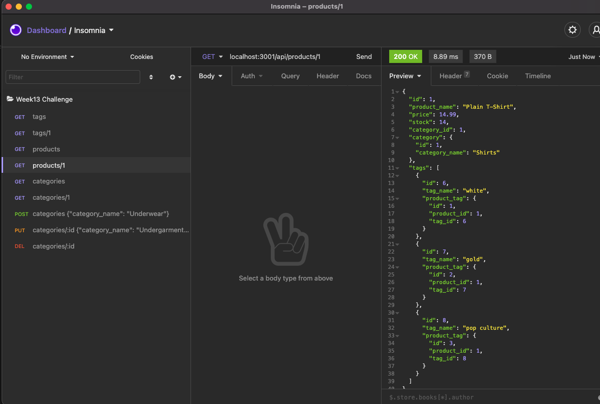
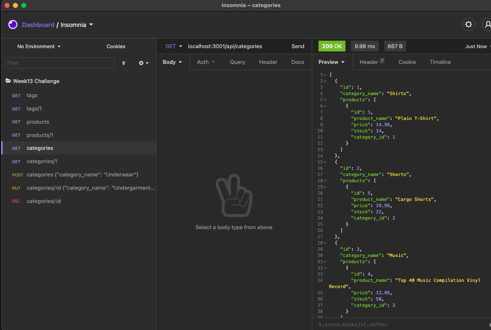
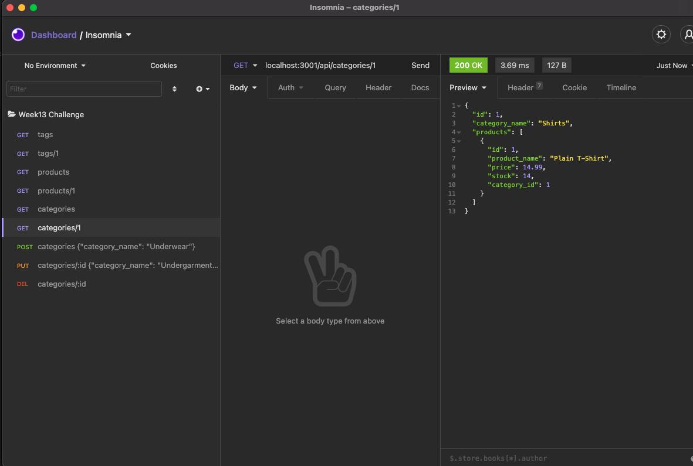
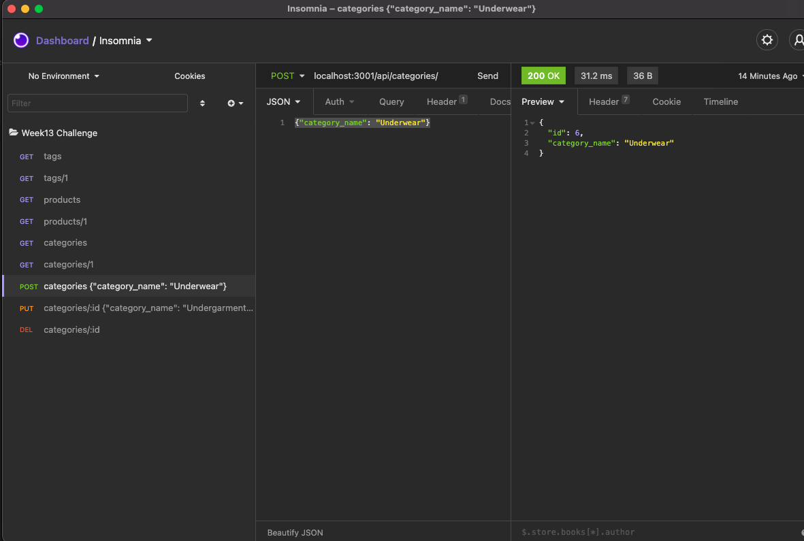
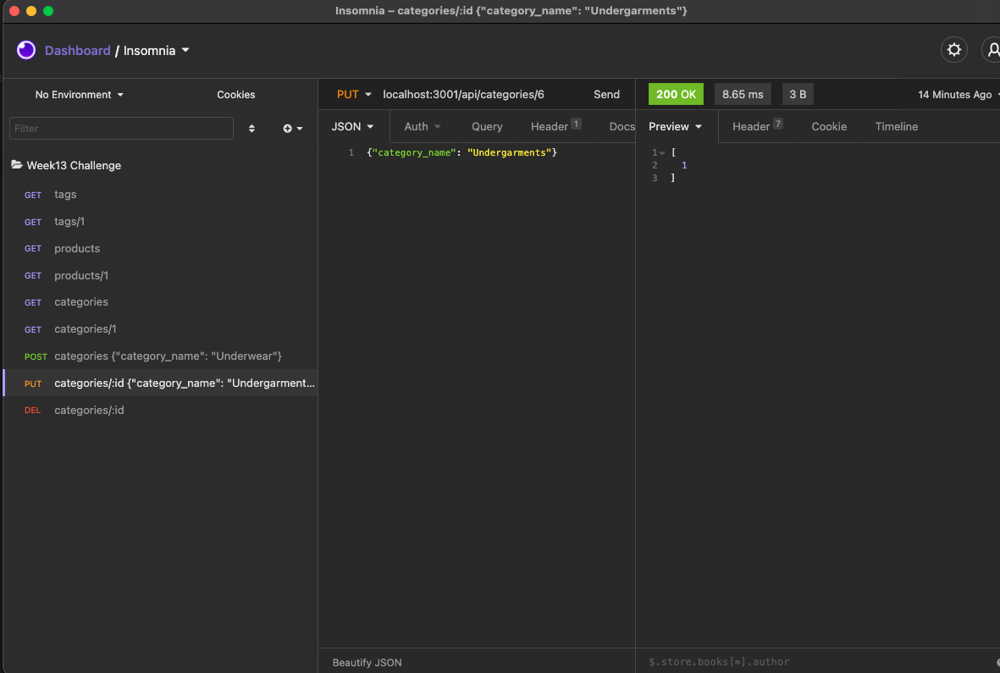
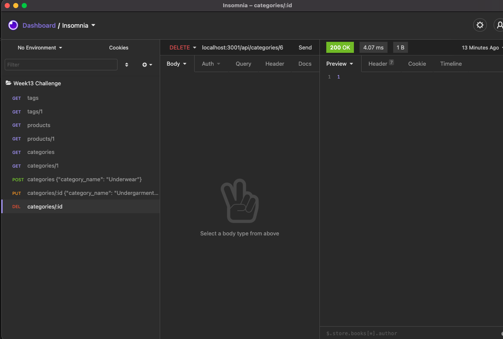

## Questions

Please visit my repo here for any further questions: <https://github.com/vmcguire>

My email address is: <victor.mcguire@gmail.com>
